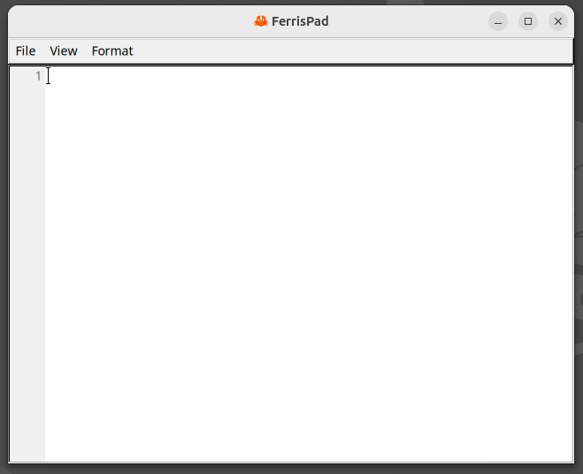
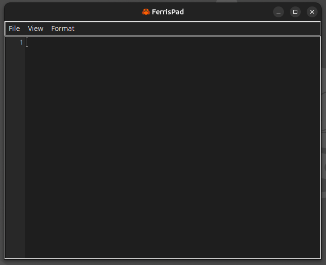

# 🦀 FerrisPad

<div align="center">
  
  <p><em>A blazingly fast, minimalist notepad written in Rust</em></p>
</div>

## Overview

FerrisPad is a simple, ultra-fast text editor built with Rust and FLTK. Named after **Ferris** 🦀 (the beloved mascot of the Rust programming language), this notepad embodies the Rust philosophy of being fast, reliable, and memory-safe.

It's designed for those who want something that just works - no bells and whistles, no feature bloat, just a clean, responsive notepad that opens instantly and gets out of your way.

This isn't meant to change the landscape of text editors. It's meant to be that reliable tool you can always count on when you need to quickly jot something down or edit a file without waiting for heavy editors to load.

> **About Ferris**: Ferris is the unofficial mascot of Rust, a friendly orange crab that represents the community values of the language: safety, speed, and concurrency. Just like Ferris helps make Rust development enjoyable, FerrisPad aims to make text editing simple and delightful.

## Features

✨ **Lightning Fast** - Opens instantly, no splash screens or loading delays
🎨 **Light & Dark Modes** - Automatically detects your system theme
📝 **Clean Interface** - Minimal, distraction-free design
📄 **Essential Tools** - Line numbers, word wrap, font customization
💾 **Native File Dialogs** - Familiar save/open experience
⌨️ **Standard Shortcuts** - Ctrl+N, Ctrl+O, Ctrl+S, Ctrl+Q
🖋️ **Font Options** - Multiple monospace fonts and sizes
👁️ **Blinking Cursor** - Clear visual feedback
🦀 **Proper Icons** - Beautiful crab mascot icons in all standard sizes
🖥️ **Desktop Integration** - Application menu entry and system icon support
📄 **File Title Display** - Shows filename (or "Untitled") in window title

## Screenshots

<div align="center">
  <h3>Light Mode</h3>
  
  <p><em>Clean, bright interface with line numbers and monospace font</em></p>
</div>

<div align="center">
  <h3>Dark Mode</h3>
  
  <p><em>Easy on the eyes dark theme with syntax-friendly colors</em></p>
</div>

## Installation

### Prerequisites
- Rust (latest stable version)
- FLTK dependencies for your system

#### Linux (Ubuntu/Debian)
```bash
sudo apt-get install libfltk1.3-dev libfontconfig1-dev libxext-dev libxft-dev libxinerama-dev libxcursor-dev libxrender-dev libxfixes-dev libpango1.0-dev libgl1-mesa-dev libglu1-mesa-dev
```

#### macOS
```bash
# FLTK should work out of the box with Xcode command line tools
xcode-select --install
```

### Build from Source
```bash
git clone https://github.com/fedro86/ferrispad
cd ferrispad
cargo build --release
```

### Install Desktop Integration

#### Linux
For proper icon display and application menu integration:
```bash
./install-desktop.sh
```

This will:
- Install FerrisPad icons in all standard sizes (16x16 to 512x512)
- Create desktop entry for application menu
- Register with the desktop environment
- Enable proper icon display in taskbar/dock

To uninstall:
```bash
./uninstall-desktop.sh
```

#### macOS
Currently, the desktop integration scripts are Linux-specific. On macOS:
- The compiled binary will run fine: `./target/release/FerrisPad`
- Icons may not display properly in the dock
- For proper macOS integration, the app would need to be packaged as a `.app` bundle

**Note**: macOS app bundle creation is planned for future releases.

### Run
```bash
# Run from source
cargo run --release

# Or run the compiled binary
./target/release/FerrisPad

# Or launch from application menu (after installing desktop integration)
```

## Usage

### Keyboard Shortcuts
- **Ctrl+N** - New file
- **Ctrl+O** - Open file
- **Ctrl+S** - Save As
- **Ctrl+Q** - Quit

### View Options
- **View → Toggle Line Numbers** - Show/hide line numbers
- **View → Toggle Word Wrap** - Enable/disable text wrapping
- **View → Toggle Dark Mode** - Switch between light and dark themes

### Format Options
- **Format → Font** - Choose from monospace font options
- **Format → Font Size** - Select from Small (12), Medium (16), or Large (20)

## Building Your Own Features

FerrisPad is intentionally simple and well-structured, making it easy to extend. The codebase is clean and documented, perfect for:

- **Learning Rust GUI development** with FLTK
- **Adding your own features** (syntax highlighting, find/replace, etc.)
- **Customizing the interface** to your needs
- **Understanding cross-platform desktop app architecture**

Key files:
- `src/main.rs` - Main application logic
- `assets/` - Application icons and resources

## Technology Stack

- **Language**: Rust 🦀
- **GUI Framework**: FLTK (Fast Light Toolkit)
- **Image Handling**: Embedded PNG assets
- **Platform Support**: Linux, macOS, Windows

## Philosophy

FerrisPad follows the Unix philosophy: do one thing and do it well. It's not trying to be VSCode or Vim or Emacs. It's just a notepad that:

- Starts instantly
- Handles text editing reliably
- Stays out of your way
- Provides a solid foundation for customization

## Troubleshooting

### Icons Not Showing
If the crab icon doesn't appear in your taskbar or application menu:

1. **Run the installation script**:
   ```bash
   ./install-desktop.sh
   ```

2. **Clear icon cache**:
   ```bash
   rm -rf ~/.cache/icon-theme.cache
   gtk-update-icon-cache -f -t ~/.local/share/icons/hicolor/
   ```

3. **Restart your desktop environment** or log out and log back in

4. **Check if icons were installed**:
   ```bash
   ls ~/.local/share/icons/hicolor/32x32/apps/ferrispad.png
   ```

### Application Not in Menu
If FerrisPad doesn't appear in your application menu:
```bash
update-desktop-database ~/.local/share/applications
```

## Contributing

This project welcomes contributions! Whether you want to:
- Fix bugs
- Add simple features
- Improve documentation
- Optimize performance

Feel free to fork the repository and submit pull requests.

## License

[MIT License](LICENSE) - Feel free to use this project as a starting point for your own text editor adventures!

---

<div align="center">
  <p>Built with ❤️ and 🦀 by developers who believe software should be fast and simple</p>
</div>