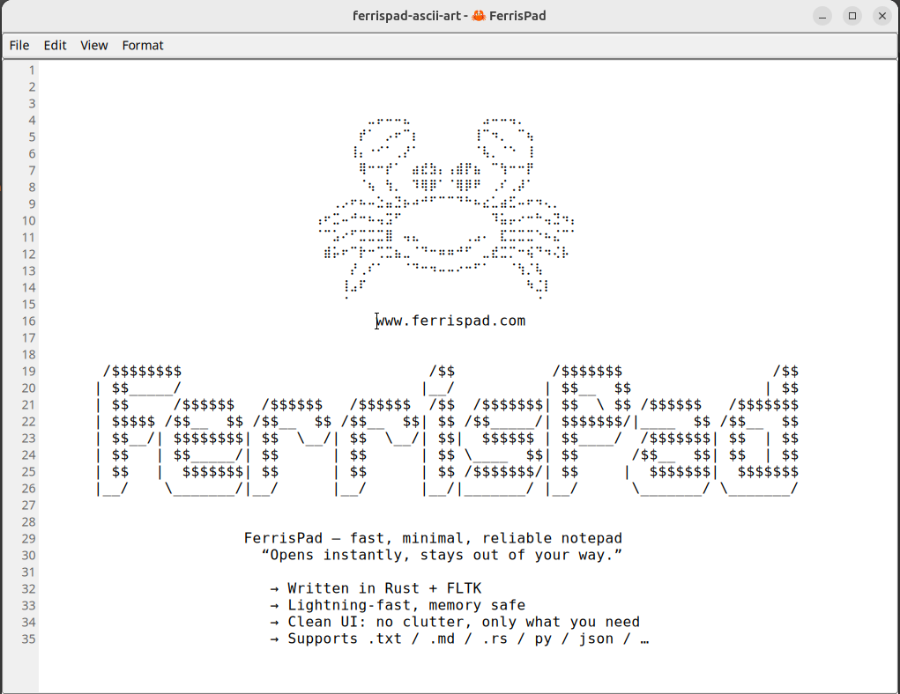
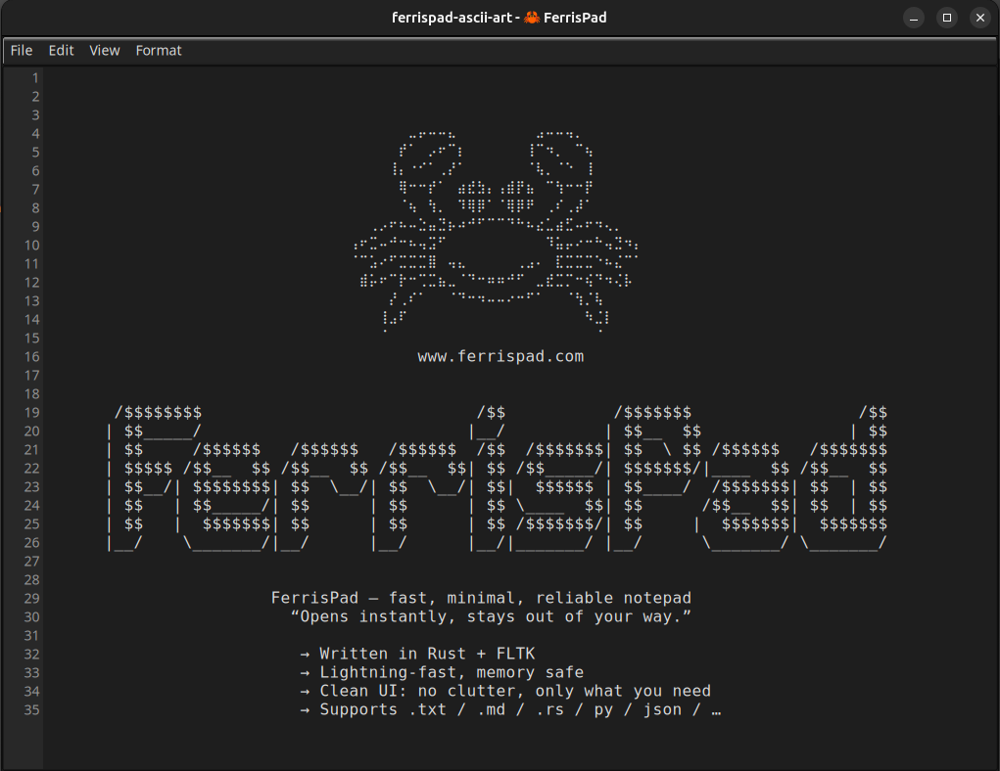

# FerrisPad

<div align="center">
  
  <p><em>A blazingly fast, feature-rich text editor written in Rust</em></p>
</div>

## Overview

FerrisPad is a fast, lightweight text editor built with Rust and FLTK. Named after **Ferris** (the beloved mascot of the Rust programming language), it combines the responsiveness of a simple notepad with the features you actually need for daily editing.

It opens instantly, supports syntax highlighting for 50+ languages, manages multiple files with tab groups, and restores your full session across restarts. All in a single, self-contained binary with **no runtime dependencies**.

> **About Ferris**: Ferris is the unofficial mascot of Rust, a friendly orange crab that represents the community values of the language: safety, speed, and concurrency.

## Philosophy

FerrisPad is built with a strict technical "constitution." We guarantee **0% CPU usage when idle**, **RAM frugality** through active memory management, a single self-contained binary, and absolute privacy with zero telemetry.

Read the full [FerrisPad Philosophy](PHILOSOPHY.md) to understand how we decide on new features.

## Features

**Core Editing**
- Lightning-fast startup with zero splash screens or loading delays
- Find & Replace with forward/backward search, case-sensitive option, and Replace All
- Go to Line dialog for quick navigation
- Line numbers, word wrap, and font customization
- Undo/Redo support

**Syntax Highlighting**
- Over 50 languages supported out of the box (Rust, Python, JavaScript, Markdown, JSON, etc.)
- Chunked, non-blocking processing for large files (2000-line chunks via FLTK event loop)
- Sparse checkpoints every 128 lines for efficient incremental re-highlighting

<div align="center">
  <video src="docs/assets/videos/syntax_highlight.mp4" width="800" controls muted autoplay loop></video>
</div>

**Tabs & Groups**
- Draggable tabs with reorder support
- Tab groups with colored labels (Red, Orange, Yellow, Green, Blue, Purple, Grey)
- Drag to tab center to group, drag to edges to reorder
- Collapse/expand groups into compact chips
- Drag collapsed groups to reorder entire groups
- "+" button for quick new tab creation
- Middle-click to close tabs, right-click context menu for group management

<div align="center">
  <video src="docs/assets/videos/activate_tabs.mp4" width="800" controls muted autoplay loop></video>
</div>

**Session & Persistence**
- Three restore modes: Off, Saved Files Only, Full (including unsaved content)
- Auto-saves session every 30 seconds to survive crashes and forced kills
- Persistent settings (theme, font, view options, update preferences)
- Remembers last open directory

<div align="center">
  <video src="docs/assets/videos/session_restore.mp4" width="800" controls muted autoplay loop></video>
</div>

**Markdown Preview**
- Live preview for Markdown files with async image resizing
- Toggle preview on/off

<div align="center">
  <video src="docs/assets/videos/md_preview.mp4" width="800" controls muted autoplay loop></video>
</div>

**Appearance**
- Light & Dark modes with automatic system theme detection
- Multiple monospace fonts and configurable font sizes
- GTK-native look on Linux

**Updates & Privacy**
- In-app update checker with stable/unstable channel support
- Checks GitHub once per 24 hours (fully optional, can be disabled)
- No telemetry, no tracking, no personal data collected
- Subtle banner notification when updates are available

**Cross-Platform**
- Linux, macOS, and Windows support
- Desktop integration with proper icons in all standard sizes
- Native file dialogs

## Screenshots

<div align="center">
  <h3>Light Mode</h3>
  
  <p><em>Clean, bright interface with line numbers and syntax highlighting</em></p>
</div>

<div align="center">
  <h3>Dark Mode</h3>
  
  <p><em>Easy on the eyes dark theme with syntax-friendly colors</em></p>
</div>

## Installation

### Download Pre-Built Binaries

**Visit our website:** [www.ferrispad.com](https://www.ferrispad.com)

Download ready-to-use binaries for:
- **Linux** - `.deb` package (Ubuntu/Debian)
- **macOS** - Universal `.dmg` (Intel + Apple Silicon)
- **Windows** - Portable `.zip` archive

### Quick Install (Linux/Ubuntu)

```bash
wget https://github.com/fedro86/ferrispad/releases/latest/download/FerrisPad-ubuntu-amd64.deb
sudo dpkg -i FerrisPad-ubuntu-amd64.deb
FerrisPad
```

### Windows Security Warning

When running FerrisPad on Windows for the first time, you may see a "Windows protected your PC" warning. This is normal for open source software not signed with a commercial certificate.

**FerrisPad is safe to run.** The source code is open and auditable on GitHub.

1. Click "More info" on the warning dialog
2. Click "Run anyway"

If Windows Defender quarantines the executable, add an exclusion for the FerrisPad folder in Windows Security > Virus & threat protection > Exclusions.

### macOS Security Warning

On first launch, macOS may block the app from an "unidentified developer." The most reliable fix:

```bash
xattr -cr /Applications/FerrisPad.app
```

Alternatively: System Settings > Privacy & Security > Click "Open Anyway".

### Build from Source

**Prerequisites:** Rust (latest stable)

**Linux (Ubuntu/Debian):**
```bash
sudo apt-get install libfltk1.3-dev libfontconfig1-dev libxext-dev libxft-dev \
  libxinerama-dev libxcursor-dev libxrender-dev libxfixes-dev libpango1.0-dev \
  libgl1-mesa-dev libglu1-mesa-dev
```

**macOS:**
```bash
xcode-select --install
```

**Build:**
```bash
git clone https://github.com/fedro86/ferrispad
cd ferrispad
cargo build --release
./target/release/FerrisPad
```

**Build distribution packages:**
```bash
# Interactive build menu for all platforms
./scripts/build-releases.sh

# Or build .deb package directly (Linux)
cargo install cargo-deb
cargo deb
```

See [BUILD_GUIDE.md](docs/guides/BUILD_GUIDE.md) for detailed build instructions.

### Desktop Integration (Linux)

For proper icon display and application menu integration when building from source:
```bash
./scripts/install-desktop.sh    # Install
./scripts/uninstall-desktop.sh  # Uninstall
```

The `.deb` package handles this automatically.

## Usage

### Keyboard Shortcuts

| Shortcut | Action |
|---|---|
| Ctrl+N | New file |
| Ctrl+O | Open file |
| Ctrl+S | Save |
| Ctrl+Shift+S | Save As |
| Ctrl+Q | Quit |
| Ctrl+F | Find |
| Ctrl+H | Find & Replace |
| Ctrl+G | Go to Line |
| Ctrl+Page Down | Next tab |
| Ctrl+Page Up | Previous tab |
| Ctrl+W | Close active tab |

### Tab Groups

- **Right-click** a tab to access group management (create, rename, recolor, ungroup)
- **Drag** a tab onto another tab's center to group them together
- **Drag** a tab to the edge of another tab to reorder
- **Click** a group label to collapse/expand
- **Drag** a collapsed group chip to reorder the entire group

### Settings

**File > Settings** opens the settings dialog where you can configure:
- Theme mode (Light / Dark / System Default)
- Font family and size
- Line numbers and word wrap
- Session restore mode (Off / Saved Files / Full)
- Auto-update checking and update channel (Stable / Unstable)

## Architecture

~5,200 lines across 28 files. Message-passing event-driven architecture.

```
src/
  app/           # Business logic
    state.rs         # Central controller (AppState)
    tab_manager.rs   # Tab and group management
    document.rs      # Document model
    session.rs       # Session persistence
    highlight_controller.rs  # Syntax highlighting engine
    preview_controller.rs    # Markdown preview
    settings.rs      # Persistent settings
    updater.rs       # Update checker
  ui/            # Presentation layer
    tab_bar.rs       # Custom tab bar with drag-and-drop
    main_window.rs   # Window layout
    menu.rs          # Menu bar
    dialogs/         # Find, Replace, GoTo, Settings, About, Update
  main.rs        # Event dispatch loop
```

## Technology Stack

- **Language**: Rust (2024 edition)
- **GUI Framework**: FLTK via fltk-rs
- **Syntax Highlighting**: syntect with oniguruma regex backend
- **Allocator**: jemalloc (Linux/macOS) for reduced memory fragmentation
- **Platform Support**: Linux, macOS, Windows

## Contributing

Contributions are welcome! Whether you want to fix bugs, add features, improve documentation, or optimize performance, feel free to fork and submit pull requests.

## License

[MIT License](LICENSE)

---

<div align="center">
  <p>Built with Rust by developers who believe software should be fast and simple</p>
</div>
